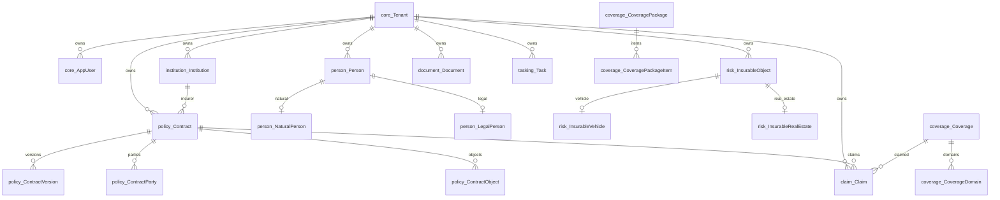
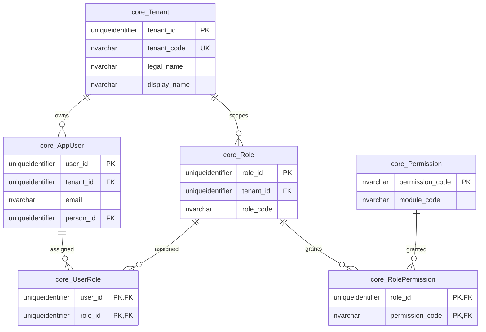
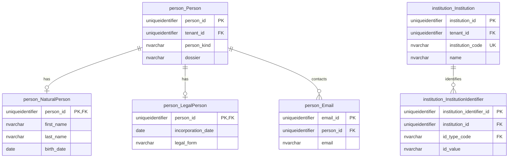
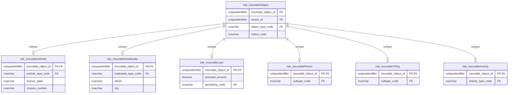
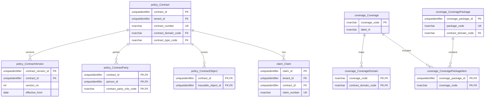
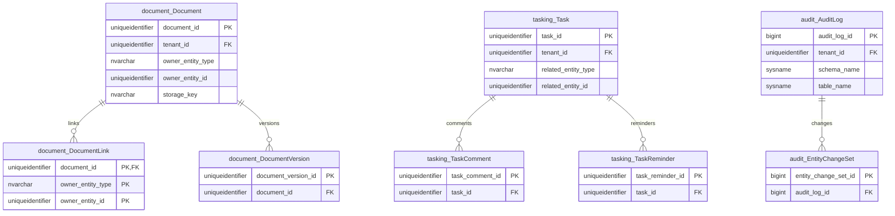

# ERD Mermaid

## Domain'ler Arası Genel Bakış

```mermaid
erDiagram
    core_Tenant ||--o{ core_AppUser : owns
    core_Tenant ||--o{ person_Person : owns
    core_Tenant ||--o{ institution_Institution : owns
    core_Tenant ||--o{ risk_InsurableObject : owns
    core_Tenant ||--o{ policy_Contract : owns
    core_Tenant ||--o{ claim_Claim : owns
    core_Tenant ||--o{ document_Document : owns
    core_Tenant ||--o{ tasking_Task : owns

    person_Person ||--o| person_NaturalPerson : natural
    person_Person ||--o| person_LegalPerson : legal
    institution_Institution ||--o{ policy_Contract : insurer
    risk_InsurableObject ||--o| risk_InsurableVehicle : vehicle
    risk_InsurableObject ||--o| risk_InsurableRealEstate : real_estate
    policy_Contract ||--o{ policy_ContractVersion : versions
    policy_Contract ||--o{ policy_ContractParty : parties
    policy_Contract ||--o{ policy_ContractObject : objects
    policy_Contract ||--o{ claim_Claim : claims
    coverage_Coverage ||--o{ claim_Claim : claimed
    coverage_Coverage ||--o{ coverage_CoverageDomain : domains
    coverage_CoveragePackage ||--o{ coverage_CoveragePackageItem : items
```

## Core

```mermaid
erDiagram
    core_Tenant {
        uniqueidentifier tenant_id PK
        nvarchar tenant_code UK
        nvarchar legal_name
        nvarchar display_name
    }
    core_AppUser {
        uniqueidentifier user_id PK
        uniqueidentifier tenant_id FK
        nvarchar email
        uniqueidentifier person_id FK
    }
    core_Role {
        uniqueidentifier role_id PK
        uniqueidentifier tenant_id FK
        nvarchar role_code
    }
    core_Permission {
        nvarchar permission_code PK
        nvarchar module_code
    }
    core_RolePermission {
        uniqueidentifier role_id PK,FK
        nvarchar permission_code PK,FK
    }
    core_UserRole {
        uniqueidentifier user_id PK,FK
        uniqueidentifier role_id PK,FK
    }
    core_Tenant ||--o{ core_AppUser : owns
    core_Tenant ||--o{ core_Role : scopes
    core_Role ||--o{ core_RolePermission : grants
    core_Permission ||--o{ core_RolePermission : granted
    core_AppUser ||--o{ core_UserRole : assigned
    core_Role ||--o{ core_UserRole : assigned
```

## Person ve Institution

```mermaid
erDiagram
    person_Person {
        uniqueidentifier person_id PK
        uniqueidentifier tenant_id FK
        nvarchar person_kind
        nvarchar dossier
    }
    person_NaturalPerson {
        uniqueidentifier person_id PK,FK
        nvarchar first_name
        nvarchar last_name
        date birth_date
    }
    person_LegalPerson {
        uniqueidentifier person_id PK,FK
        date incorporation_date
        nvarchar legal_form
    }
    person_Email {
        uniqueidentifier email_id PK
        uniqueidentifier person_id FK
        nvarchar email
    }
    institution_Institution {
        uniqueidentifier institution_id PK
        uniqueidentifier tenant_id FK
        nvarchar institution_code UK
        nvarchar name
    }
    institution_InstitutionIdentifier {
        uniqueidentifier institution_identifier_id PK
        uniqueidentifier institution_id FK
        nvarchar id_type_code FK
        nvarchar id_value
    }
    person_Person ||--o| person_NaturalPerson : has
    person_Person ||--o| person_LegalPerson : has
    person_Person ||--o{ person_Email : contacts
    institution_Institution ||--o{ institution_InstitutionIdentifier : identifies
```

## Risk

```mermaid
erDiagram
    risk_InsurableObject {
        uniqueidentifier insurable_object_id PK
        uniqueidentifier tenant_id FK
        nvarchar object_type_code FK
        nvarchar status_code
    }
    risk_InsurableVehicle {
        uniqueidentifier insurable_object_id PK,FK
        nvarchar vehicle_type_code FK
        nvarchar license_plate
        nvarchar chassis_number
    }
    risk_InsurableRealEstate {
        uniqueidentifier insurable_object_id PK,FK
        nvarchar realestate_type_code FK
        nvarchar street
        nvarchar city
    }
    risk_InsurableLoan {
        uniqueidentifier insurable_object_id PK,FK
        decimal principal_amount
        nvarchar periodicity_code FK
    }
    risk_InsurablePerson {
        uniqueidentifier insurable_object_id PK,FK
        nvarchar subtype_code FK
    }
    risk_InsurableThing {
        uniqueidentifier insurable_object_id PK,FK
        nvarchar subtype_code FK
    }
    risk_InsurableActivity {
        uniqueidentifier insurable_object_id PK,FK
        nvarchar activity_type_code FK
    }
    risk_InsurableObject ||--o| risk_InsurableVehicle : subtype
    risk_InsurableObject ||--o| risk_InsurableRealEstate : subtype
    risk_InsurableObject ||--o| risk_InsurableLoan : subtype
    risk_InsurableObject ||--o| risk_InsurablePerson : subtype
    risk_InsurableObject ||--o| risk_InsurableThing : subtype
    risk_InsurableObject ||--o| risk_InsurableActivity : subtype
```

## Policy, Coverage, Claim

```mermaid
erDiagram
    policy_Contract {
        uniqueidentifier contract_id PK
        uniqueidentifier tenant_id FK
        nvarchar contract_number UK
        nvarchar contract_domain_code FK
        nvarchar contract_type_code FK
    }
    policy_ContractVersion {
        uniqueidentifier contract_version_id PK
        uniqueidentifier contract_id FK
        int version_no
        date effective_from
    }
    policy_ContractParty {
        uniqueidentifier contract_id PK,FK
        uniqueidentifier person_id PK,FK
        nvarchar contract_party_role_code PK,FK
    }
    policy_ContractObject {
        uniqueidentifier contract_id PK,FK
        uniqueidentifier insurable_object_id PK,FK
    }
    coverage_Coverage {
        nvarchar coverage_code PK
        nvarchar label_nl
    }
    coverage_CoverageDomain {
        nvarchar coverage_code PK,FK
        nvarchar contract_domain_code PK,FK
    }
    coverage_CoveragePackage {
        uniqueidentifier coverage_package_id PK
        nvarchar package_code UK
        nvarchar contract_domain_code FK
    }
    coverage_CoveragePackageItem {
        uniqueidentifier coverage_package_id PK,FK
        nvarchar coverage_code PK,FK
    }
    claim_Claim {
        uniqueidentifier claim_id PK
        uniqueidentifier tenant_id FK
        uniqueidentifier contract_id FK
        nvarchar claim_number UK
    }
    policy_Contract ||--o{ policy_ContractVersion : versions
    policy_Contract ||--o{ policy_ContractParty : parties
    policy_Contract ||--o{ policy_ContractObject : covers
    policy_Contract ||--o{ claim_Claim : has
    coverage_Coverage ||--o{ coverage_CoverageDomain : maps
    coverage_CoveragePackage ||--o{ coverage_CoveragePackageItem : contains
    coverage_Coverage ||--o{ coverage_CoveragePackageItem : included
```

## Document, Tasking, Audit

```mermaid
erDiagram
    document_Document {
        uniqueidentifier document_id PK
        uniqueidentifier tenant_id FK
        nvarchar owner_entity_type
        uniqueidentifier owner_entity_id
        nvarchar storage_key
    }
    document_DocumentLink {
        uniqueidentifier document_id PK,FK
        nvarchar owner_entity_type PK
        uniqueidentifier owner_entity_id PK
    }
    document_DocumentVersion {
        uniqueidentifier document_version_id PK
        uniqueidentifier document_id FK
    }
    tasking_Task {
        uniqueidentifier task_id PK
        uniqueidentifier tenant_id FK
        nvarchar related_entity_type
        uniqueidentifier related_entity_id
    }
    tasking_TaskComment {
        uniqueidentifier task_comment_id PK
        uniqueidentifier task_id FK
    }
    tasking_TaskReminder {
        uniqueidentifier task_reminder_id PK
        uniqueidentifier task_id FK
    }
    audit_AuditLog {
        bigint audit_log_id PK
        uniqueidentifier tenant_id FK
        sysname schema_name
        sysname table_name
    }
    audit_EntityChangeSet {
        bigint entity_change_set_id PK
        bigint audit_log_id FK
    }
    document_Document ||--o{ document_DocumentLink : links
    document_Document ||--o{ document_DocumentVersion : versions
    tasking_Task ||--o{ tasking_TaskComment : comments
    tasking_Task ||--o{ tasking_TaskReminder : reminders
    audit_AuditLog ||--o{ audit_EntityChangeSet : changes
```
